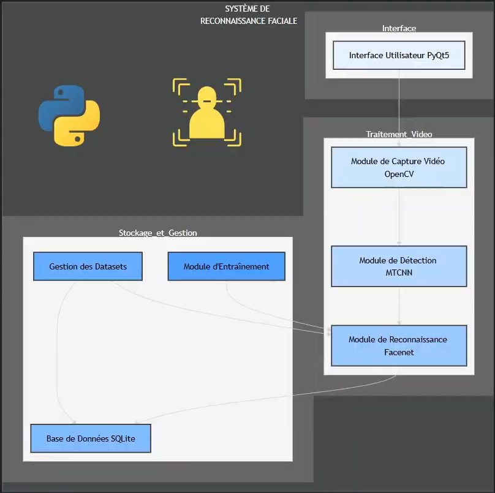
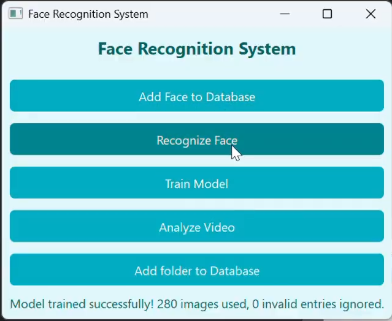
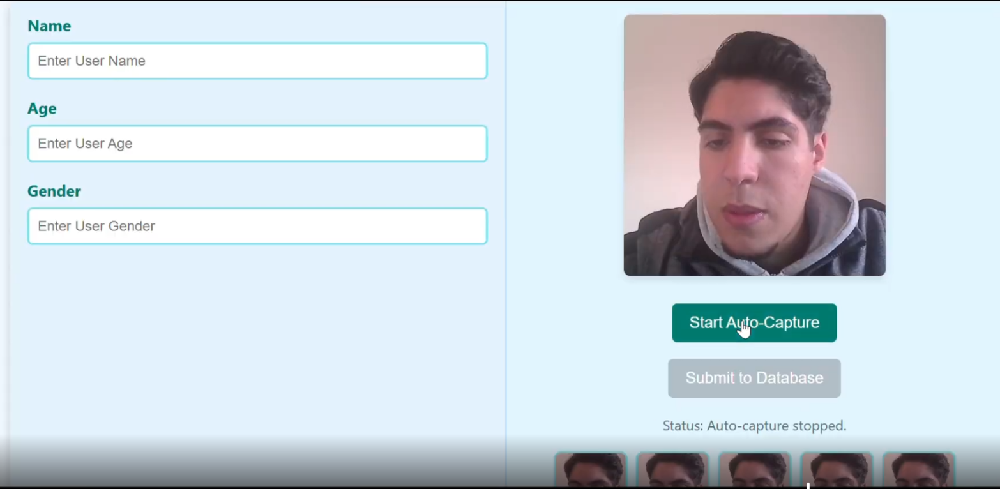
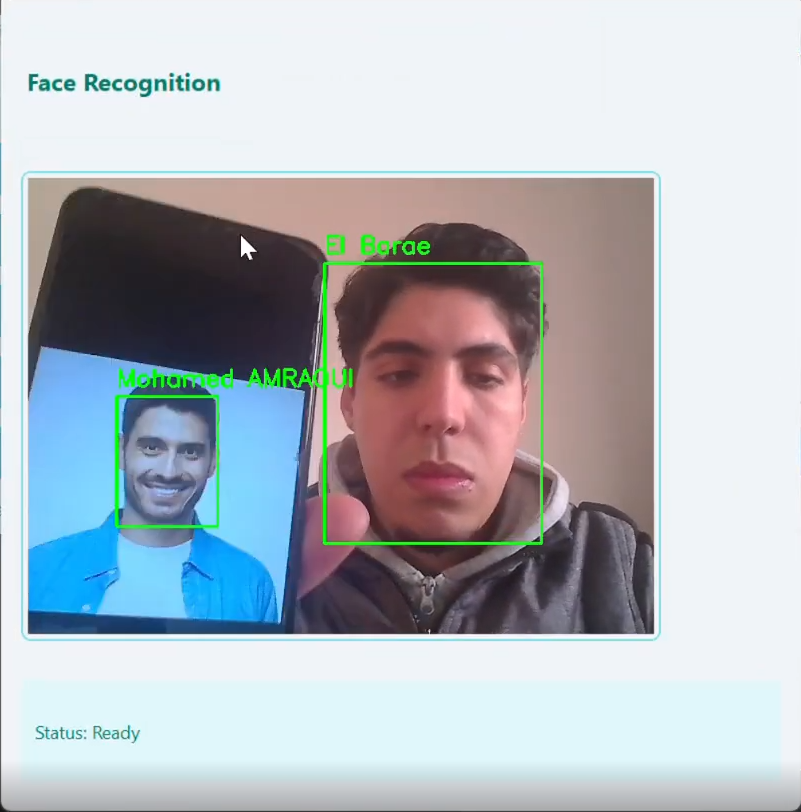
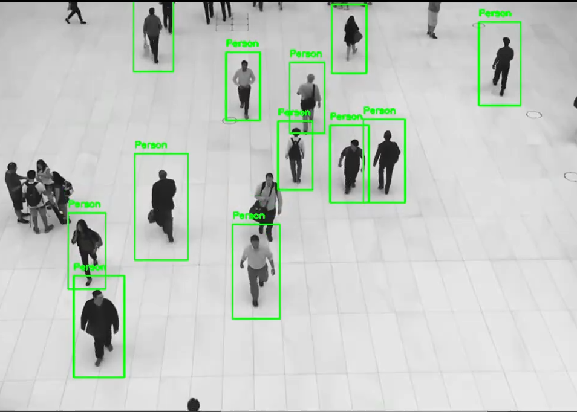

# 🎯 Système de Reconnaissance Faciale & Analyse Vidéo (Face Recognition System)

[](https://www.python.org/)
[](https://opencv.org/)
[](https://riverbankcomputing.com/software/pyqt/)
[](https://pytorch.org/)
[](https://www.sqlite.org/)

Application complète de vision par ordinateur pour la **reconnaissance faciale en temps réel**, la gestion d'identités biométriques et l'**analyse de flux vidéo** (détection de piétons/personnes). Le projet intègre une interface de bureau intuitive développée avec **PyQt5** ainsi qu'un module web avec **Flask**.

---

## 📑 Sommaire
- [Architecture du Système](#-architecture-du-système)
- [Fonctionnalités Principales](#-fonctionnalités-principales)
- [Aperçu de l'Application & Captures d'Écran](#-aperçu-de-lapplication--captures-décran)
  - [1. Menu Principal](#1-menu-principal)
  - [2. Enrôlement & Ajout à la Base de Données](#2-enrôlement--ajout-à-la-base-de-données)
  - [3. Reconnaissance Faciale en Temps Réel](#3-reconnaissance-faciale-en-temps-réel)
  - [4. Détection et Analyse Vidéo de Piétons](#4-détection-et-analyse-vidéo-de-piétons)
- [Technologies & Dépendances](#-technologies--dépendances)
- [Structure du Projet](#-structure-du-projet)
- [Installation et Configuration](#-installation-et-configuration)
- [Guide d'Utilisation](#-guide-dutilisation)
- [Auteurs & Remerciements](#-auteurs--remerciements)

---

## 🏗 Architecture du Système

Le système est conçu de manière modulaire, séparant l'interface graphique utilisateur, le pipeline de traitement vidéo et la couche de stockage des données biométriques.



### Flux de données et composants :
1. **Interface Utilisateur (PyQt5) :** Point d'entrée ergonomique permettant de piloter l'acquisition, l'entraînement et l'analyse.
2. **Traitement Vidéo :**
   - **Module de Capture Vidéo (OpenCV) :** Acquisition du flux vidéo en temps réel via webcam ou fichier vidéo.
   - **Module de Détection (MTCNN) :** Localisation et alignement précis des visages dans l'image.
   - **Module de Reconnaissance (FaceNet / InceptionResnetV1) :** Extraction des représentations vectorielles (*embeddings*) pour identification des individus.
3. **Stockage et Gestion :**
   - **Gestion des Datasets :** Acquisition automatisée et prévisualisation des échantillons de visages.
   - **Module d'Entraînement :** Construction et mise à jour des modèles de reconnaissance.
   - **Base de Données SQLite (`FaceBase.db`) :** Stockage sécurisé des identités (Nom, Âge, Genre) et des images associées.

---

## ⚡ Fonctionnalités Principales

- 📸 **Acquisition automatique des visages (*Auto-Capture*) :** Capture en rafale d'échantillons faciaux avec détection automatique et prévisualisation sous forme de galerie.
- 👥 **Identification faciale multi-personnes en temps réel :** Reconnaissance simultanée de plusieurs visages (en direct ou sur support écran) avec affichage dynamique des noms et boîtes englobantes (*bounding boxes*).
- 🧠 **Entraînement du modèle en un clic :** Entraînement rapide à partir de la base SQLite avec journalisation du nombre d'images traitées et ignorées.
- 📁 **Importation par lot (*Batch Import*) :** Ajout direct d'un dossier complet d'images à la base de données.
- 🚶 **Analyse de vidéo & Détection de foule :** Module dédié à la détection de personnes et piétons dans les vidéos de surveillance grâce aux classificateurs en cascade (*Haar Cascade Full Body*).

---

## 🖥 Aperçu de l'Application & Captures d'Écran

### 1. Menu Principal
Une interface claire offrant un accès direct à toutes les fonctionnalités clés du système.



---

### 2. Enrôlement & Ajout à la Base de Données
Formulaire d'enregistrement complet permettant de renseigner les informations personnelles (**Nom**, **Âge**, **Genre**) tout en prévisualisant le flux caméra et les clichés capturés automatiquement.



---

### 3. Reconnaissance Faciale en Temps Réel
Détection et reconnaissance haute précision sur flux direct. Le système est capable de reconnaître des visages réels tout comme des visages affichés sur des écrans ou supports photos.



---

### 4. Détection et Analyse Vidéo de Piétons
Traitement de flux vidéo enregistré ou de vidéosurveillance pour détecter et suivre les déplacements des personnes dans les espaces publics.



---

## 🛠 Technologies & Dépendances

| Catégorie | Technologies / Outils |
| :--- | :--- |
| **Langage** | Python 3.8+ |
| **Interface Graphique (Desktop)** | PyQt5 |
| **Vision par Ordinateur** | OpenCV (`opencv-python`), Haar Cascades |
| **Deep Learning & Détection** | PyTorch, `facenet-pytorch` (MTCNN, InceptionResnetV1) |
| **Traitement d'images & Calcul** | NumPy, Pillow (PIL) |
| **Base de Données** | SQLite 3 |
| **Module Web (Optionnel)** | Flask, Flask-CORS |

---

## 📁 Structure du Projet

```text
FaceRecognizationApp/
└── Python/
    ├── appDesktop/                 # Application de bureau PyQt5
    │   ├── Main.py                 # Fenêtre principale du système
    │   ├── AddToDatabase.py        # Fenêtre d'enrôlement et capture des visages
    │   ├── RecognizeFace.py        # Module de reconnaissance en direct
    │   ├── VideoAnalyzer.py        # Module d'analyse vidéo et détection de piétons
    │   ├── FaceBase.db             # Base de données SQLite locale
    │   └── face_recognizer.yml     # Modèle entraîné
    ├── appweb/                     # Application web alternative (Flask)
    │   ├── app.py                  # Serveur Flask et API
    │   ├── static/                 # Fichiers statiques (CSS, JS)
    │   └── templates/              # Gabarits HTML
    ├── docs/
    │   └── images/                 # Captures d'écran et diagramme d'architecture
    │       ├── architecture.png
    │       ├── main_menu.png
    │       ├── add_face.png
    │       ├── face_recognition.png
    │       └── video_analysis.png
    └── README.md                   # Documentation du projet
```

---

## 🚀 Installation et Configuration

### 1. Prérequis
Assurez-vous d'avoir installé **Python 3.8** ou supérieur ainsi qu'une webcam fonctionnelle.

### 2. Cloner le projet ou naviguer dans le dossier
```bash
cd FaceRecognizationApp/Python
```

### 3. Créer un environnement virtuel (recommandé)
```bash
python -m venv .venv
source .venv/bin/activate      # Sous Linux / macOS
# ou : .venv\Scripts\activate   # Sous Windows
```

### 4. Installer les dépendances
```bash
pip install -r .venv/requirements.txt
pip install PyQt5 facenet-pytorch torch torchvision opencv-python
```

---

## 🎮 Guide d'Utilisation

### Lancement de l'application Desktop
Exécutez le script principal depuis le répertoire `appDesktop` :

```bash
cd appDesktop
python Main.py
```

### Étapes recommandées :
1. **Ajouter un visage :** Cliquez sur `Add Face to Database`, remplissez les champs (**Name**, **Age**, **Gender**), lancez `Start Auto-Capture` puis validez avec `Submit to Database`.
2. **Entraîner le modèle :** Cliquez sur `Train Model` pour synchroniser le modèle avec les nouvelles entrées de la base SQLite.
3. **Lancer la reconnaissance :** Cliquez sur `Recognize Face` pour ouvrir la caméra et voir l'identification en direct.
4. **Analyser une vidéo :** Cliquez sur `Analyze Video` pour charger une vidéo et détecter les silhouettes de piétons.
